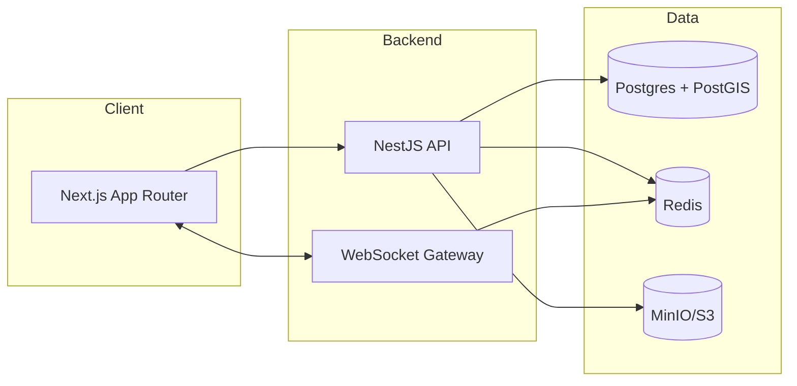
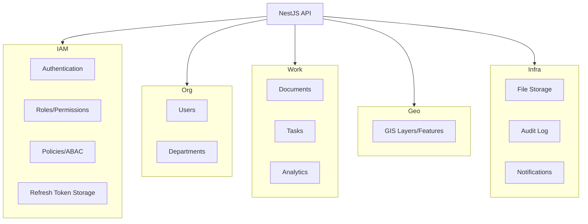
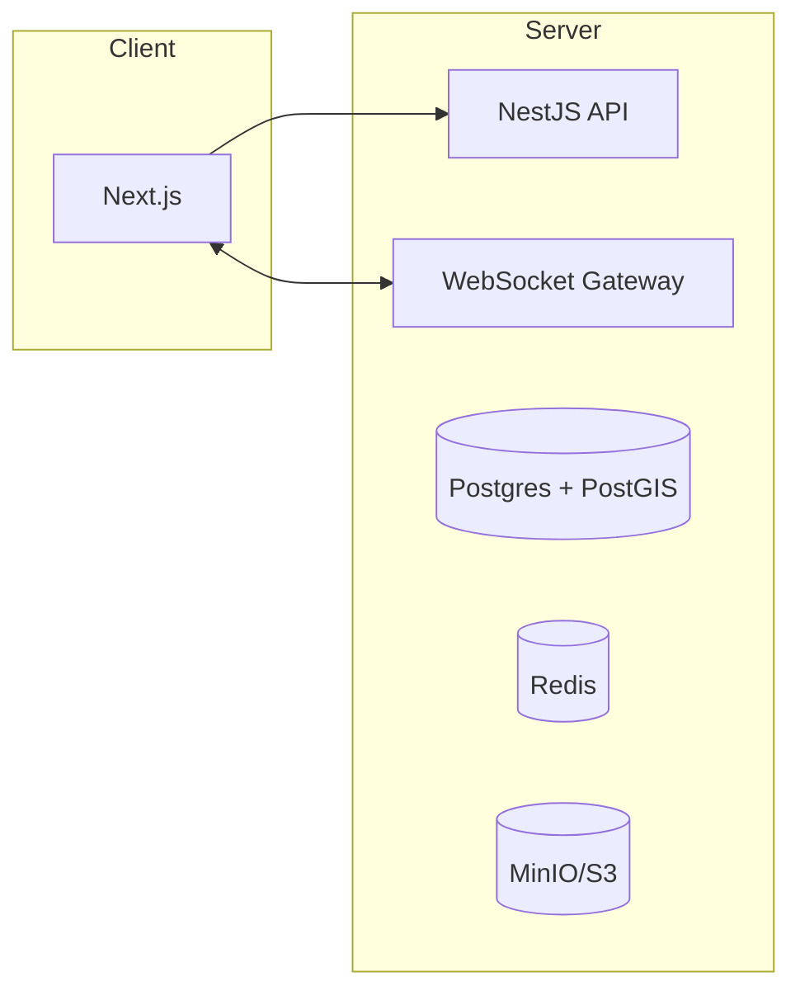

# Architecture

Last updated: 2026-02-18

This document describes the target architecture for the COESCD platform. It is intended as the baseline design for implementation and future reviews.

## Scope And Goals

Primary goals:
- Stable modular monolith with clear domain boundaries.
- Explicit API contracts and consistent authorization model.
- Data model designed for evolution (migrations, auditability).
- Infra that supports growth: Postgres, Redis, object storage, GIS.

Non goals for the first phase:
- Full microservice decomposition.
- Multi-region disaster recovery.
- Mobile app implementation details.

## Context (C4: System Context)

```mermaid
flowchart LR
  User((Operator)) --> Web[Web App (Next.js)]
  Web --> API[NestJS API]
  API --> PG[(PostgreSQL + PostGIS)]
  API --> Redis[(Redis)]
  API --> S3[(MinIO/S3)]
  API --> Notify[Notifications Provider]
  API --> ML[Prediction Service]
```

Notes:
- Prediction Service is optional and can be added later.
- Notifications Provider can be email/SMS/push.

## Containers (C4: Container Diagram)



Notes:
- WebSocket is used for realtime updates: tasks, chat, maps.
- Redis provides cache, pub/sub and queues.

## Components (C4: API Components)



## Deployment (C4: Deployment)



## Domain Modules

- IAM
  - Authentication (JWT access + refresh cookie)
  - Authorization (Roles, Permissions, Policies)
  - Sessions and refresh token rotation
- Users
  - User profiles, positions, status
- Departments
  - Hierarchical org structure and assignments
- Documents
  - Incoming/outgoing/internal, workflows
  - Attachments and metadata
- Tasks
  - Task lifecycle, assignments, SLA
- Analytics
  - Disaster types/categories/events
  - Reports by region and period
- GIS
  - Layers, features, zones, polygons
- Files
  - Object storage, versioning, access control
- Notifications
  - Email/SMS/push hooks
- Audit Log
  - Write-only events for compliance

## Authorization Model

- RBAC for coarse access: role and permissions.
- ABAC for resource scope: department, ownership, region.
- Policies enforce business constraints, example:
  - Regular user can only access tasks in their department.
  - Manager can access department scope + children departments.

## API Contract Strategy

- Define OpenAPI spec for all endpoints.
- Generate frontend API client and shared types.
- Version API as /api/v1.

## Data Model (Formal Schema)

Notation:
- PK: primary key
- FK: foreign key
- UQ: unique

### users

- id (PK)
- email (UQ)
- password_hash
- name
- avatar_url
- position
- is_verified
- role
- permissions (json)
- department_id (FK departments.id)
- created_at
- updated_at

### departments

- id (PK)
- name
- type
- parent_id (FK departments.id)
- chief_id (FK users.id)
- created_at
- updated_at

### documents

- id (PK)
- title
- description
- type (incoming/outgoing/internal)
- status (draft/sent/received/archived)
- sender_id (FK users.id)
- receiver_id (FK users.id)
- department_id (FK departments.id)
- created_at
- updated_at

### document_attachments

- id (PK)
- document_id (FK documents.id)
- file_id (FK files.id)
- created_at

### tasks

- id (PK)
- title
- description
- status
- priority
- assignee_id (FK users.id)
- department_id (FK departments.id)
- due_at
- created_at
- updated_at

### disaster_types

- id (PK)
- name
- description

### disaster_categories

- id (PK)
- name
- description

### disasters

- id (PK)
- title
- type_id (FK disaster_types.id)
- category_id (FK disaster_categories.id)
- region
- occurred_at
- meta (json)

### reports

- id (PK)
- title
- period_start
- period_end
- region
- generated_by (FK users.id)
- created_at

### gis_layers

- id (PK)
- name
- description
- type (vector/raster)
- created_at

### gis_features

- id (PK)
- layer_id (FK gis_layers.id)
- geometry (postgis geometry)
- properties (json)
- created_at

### files

- id (PK)
- bucket
- object_key
- size
- mime_type
- checksum
- owner_id (FK users.id)
- created_at

### audit_log

- id (PK)
- actor_id (FK users.id)
- action
- resource_type
- resource_id
- meta (json)
- created_at

## Key Architectural Decisions

- Use Postgres + PostGIS as single source of truth.
- Redis for caching, queues, and token rotation.
- Object storage for files, metadata in DB.
- Modular monolith with clean boundaries.

## Risks And Mitigations

- TypeORM synchronize in production: switch to migrations.
- Hardcoded Redis host/port: use config.
- No audit trail currently: add write-only audit log.

## Roadmap

Phase 1:
- IAM, Users, Departments, Documents, Tasks
- Files storage
- Audit log

Phase 2:
- Analytics + GIS
- WebSocket realtime
- Notifications

Phase 3:
- Prediction service integration
- Calls/Chat modules
```
